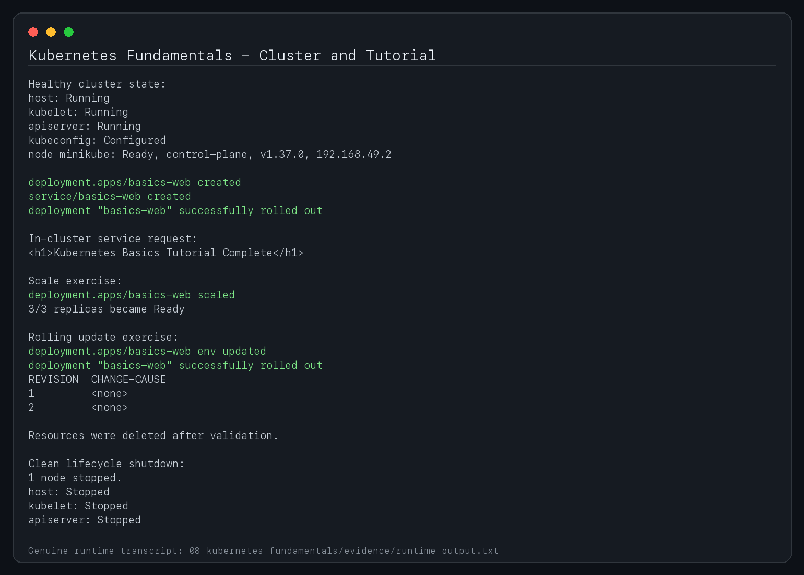

# 08 — Kubernetes Fundamentals

**Student:** Shubh Jaiswal
**Enrollment:** 24BCS10601
**Course:** SST DevOps & Cloud [SWE]
**Lecture mapping:** Lecture 9

This section follows the Lecture 9 assignment: verify the local Kubernetes tooling, execute the complete Minikube cluster lifecycle, and document Kubernetes control-plane and worker-node architecture. Runtime output below must be generated on the student's own machine; sample version numbers or IP addresses are not treated as evidence.

---

## Task 1 — Minikube Installation & Environment Setup

**One-line description:** Verify that `minikube` and `kubectl` are installed and available from the shell.

### Commands

```bash
minikube version
kubectl version --client
```

### Verified output

The real version and lifecycle transcript is committed at [`evidence/runtime-output.txt`](evidence/runtime-output.txt); the version numbers are not copied from the assignment document.

---

## Task 2 — Minikube Cluster Lifecycle Execution

**One-line description:** Start the local cluster, verify every Minikube component and the Kubernetes node, then stop the cluster cleanly.

### Start

```bash
minikube start
```

**Evidence:** the successful cluster state and Ready node are recorded in [`evidence/runtime-output.txt`](evidence/runtime-output.txt).

### Verify cluster health

```bash
minikube status
kubectl cluster-info
kubectl get nodes -o wide
```

Success means Minikube reports the host, kubelet and API server as running and `kubectl get nodes` reports the node as `Ready`.

**Evidence:** [`evidence/runtime-output.txt`](evidence/runtime-output.txt) records all Minikube components as Running and the node as Ready.

### Stop cleanly

```bash
minikube stop
minikube status
```

**Evidence:** [`evidence/runtime-output.txt`](evidence/runtime-output.txt) records the clean shutdown and all components as Stopped.

> Start Minikube again before continuing with Sections 09–11.

---

## Task 3 — Kubernetes Architecture & Core Components

Kubernetes uses a control plane to store desired state and make cluster-wide decisions, while worker-node components run and network application Pods.

### Control Plane

| Component | Responsibility |
|---|---|
| `kube-apiserver` | REST API front door for `kubectl`, controllers, schedulers and other clients. It validates API requests and exposes cluster state. |
| `etcd` | Strongly consistent key-value store containing Kubernetes API state. |
| `kube-scheduler` | Finds unscheduled Pods and assigns them to suitable nodes using resources, constraints, affinity/anti-affinity and other scheduling rules. |
| `kube-controller-manager` | Runs reconciliation loops such as Deployment, ReplicaSet and node controllers so actual state moves toward desired state. |
| `cloud-controller-manager` | Integrates Kubernetes with cloud-provider APIs for infrastructure such as routes and load balancers; a local Minikube lab does not depend on a public-cloud implementation. |

### Worker Node

| Component | Responsibility |
|---|---|
| `kubelet` | Node agent that watches assigned PodSpecs and asks the container runtime to keep their containers running. |
| Container runtime | Runs containers through the Kubernetes CRI; common runtimes include containerd and CRI-O. |
| `kube-proxy` | Implements Service traffic forwarding/routing rules on nodes. |
| Pod | Smallest deployable Kubernetes unit; its containers share the Pod network namespace and can share volumes. |

### What happens when a manifest is applied

```text
kubectl
   |
   v
kube-apiserver <----> etcd
   |
   +----> scheduler chooses a node
   |
   +----> controllers reconcile desired state
                    |
                    v
                 kubelet
                    |
                    v
            container runtime
                    |
                    v
                   Pod
```

A typical flow is:

1. `kubectl apply` sends the object to `kube-apiserver`.
2. The API server validates the request and stores desired state in `etcd`.
3. The scheduler assigns an unscheduled Pod to a node.
4. The node's kubelet asks the container runtime to create the containers.
5. Controllers continuously observe the API and reconcile failures or changes.
6. Service networking components route traffic to eligible Pods.

### Architecture verification commands

When Minikube is running:

```bash
kubectl get pods -n kube-system -o wide
kubectl get nodes -o wide
kubectl cluster-info
```

These commands connect the written architecture to the components visible in the local cluster.

---

## Task 4 - Basic objects and commands

`basic-objects.yaml` demonstrates a ConfigMap, Deployment, ReplicaSet-managed Pods and a ClusterIP Service.

```bash
kubectl apply -f basic-objects.yaml
kubectl get all,configmap -o wide
kubectl describe deployment fundamentals-web
kubectl get replicasets
kubectl get pods --show-labels
kubectl logs deployment/fundamentals-web
kubectl exec deployment/fundamentals-web -- wget -q -O- http://fundamentals-web/
kubectl scale deployment fundamentals-web --replicas=3
kubectl set image deployment/fundamentals-web nginx=nginx:1.27-alpine
kubectl rollout status deployment/fundamentals-web
kubectl rollout history deployment/fundamentals-web
kubectl delete -f basic-objects.yaml
```

`apply` creates/reconciles desired state; `get` lists; `describe` combines specification, status and Events; `logs` reads container output; `exec` runs a process inside a container; `scale` changes replica count; and `rollout` observes Deployment history/status.

## Task 5 - Kubernetes Basics tutorial hands-on

The standard Learn Kubernetes Basics flow is reproduced locally:

1. **Create a cluster:** `minikube start` and inspect nodes.
2. **Deploy an app:** apply `basic-objects.yaml` and inspect the Deployment/Pods.
3. **Explore:** use `get`, `describe`, `logs` and `exec`.
4. **Expose:** access the ClusterIP from a temporary client or use port-forward.
5. **Scale:** change the Deployment from two to three replicas.
6. **Update:** set a new image and observe rolling status/history.

```bash
kubectl port-forward service/fundamentals-web 8089:80
curl http://127.0.0.1:8089/
```

The complete tutorial command transcript is captured in `screenshots/05-basics-tutorial.png`.

## Submission evidence checklist

- [x] Actual Minikube and kubectl versions recorded in `evidence/runtime-output.txt`.
- [x] Successful cluster start/state recorded in `evidence/runtime-output.txt`.
- [x] Running components and a Ready node recorded in `evidence/runtime-output.txt`.
- [x] Clean Minikube stop/status recorded in `evidence/runtime-output.txt`.
- [x] Apply/explore/expose/scale/update workflow recorded in `evidence/runtime-output.txt`.
- [x] Control-plane and worker-node architecture documented above.

No terminal transcript or screenshot in this section should be copied from another student's repository.

## Submission screenshot


