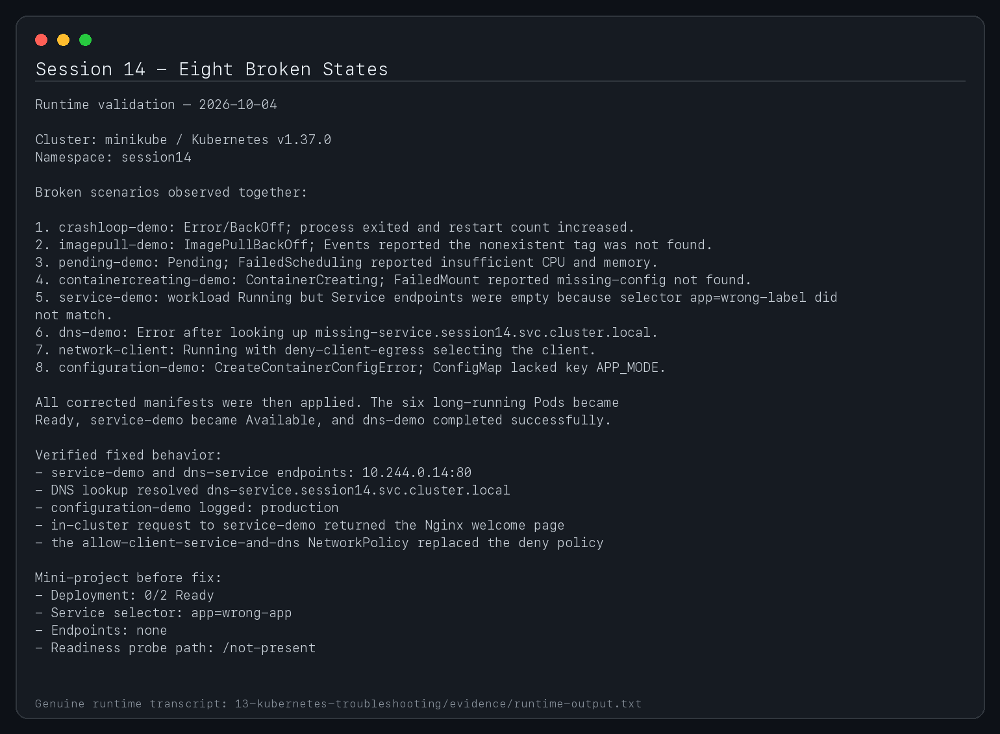
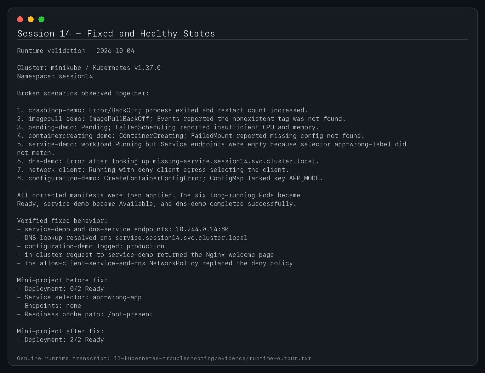
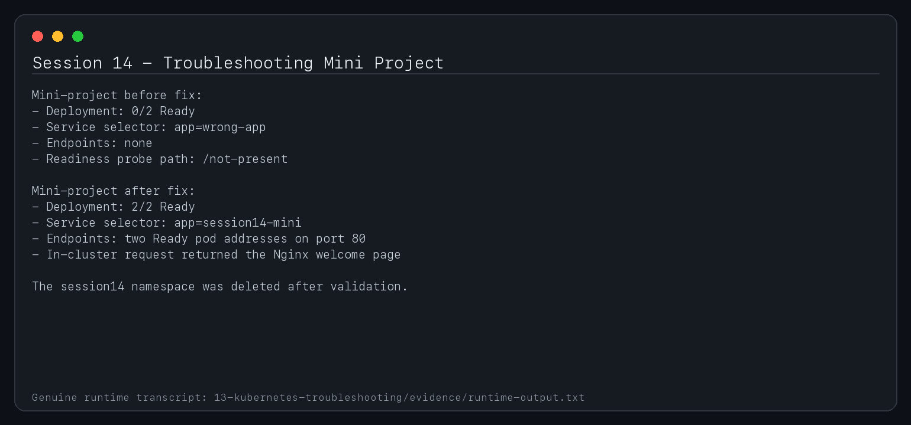

# Session 14 - Kubernetes Troubleshooting

**Student:** Shubh Jaiswal
**Enrollment:** 24BCS10601

This lab turns common failure states into repeatable diagnoses. Each scenario contains a deliberately broken manifest and a corrected manifest. Use namespace `session14` and delete a broken resource before applying its fixed version.

## Core troubleshooting commands

| Command | Why it is useful |
|---|---|
| `kubectl get <resource> -o wide` | Fast state, node, IP, readiness and placement view |
| `kubectl describe <resource>` | Conditions, configuration and chronological Events |
| `kubectl logs POD [-c CONTAINER] --previous` | Current or previously crashed container output |
| `kubectl exec POD -- COMMAND` | Inspect a running container from inside its network/filesystem |
| `kubectl events --sort-by=.metadata.creationTimestamp` | Namespace event timeline |
| `kubectl explain TYPE.FIELD` | Schema documentation from the API server |
| `kubectl top pod,node` | CPU/memory usage when metrics-server is installed |
| `kubectl get all -o wide` | Broad workload and networking inventory |

Create the lab namespace:

```bash
kubectl create namespace session14
kubectl config set-context --current --namespace=session14
```

## Failure matrix

| Issue | Broken manifest | Investigation and root cause | Fix and verification |
|---|---|---|---|
| CrashLoopBackOff | `scenarios/01-crashloop/broken.yaml` | `logs --previous` shows the process exits with code 1 | Apply `fixed.yaml`; wait for Ready and verify restart count stays stable |
| ErrImagePull / ImagePullBackOff | `02-imagepull/broken.yaml` | Events show the nonexistent image tag cannot be pulled | Correct the image in `fixed.yaml` |
| Pending | `03-pending/broken.yaml` | `describe pod` reports insufficient CPU | Use a schedulable request in `fixed.yaml` |
| ContainerCreating | `04-containercreating/broken.yaml` | Events show a missing ConfigMap volume | `fixed.yaml` creates the ConfigMap before the Pod |
| Service connectivity | `05-service-connectivity/broken.yaml` | Service has no endpoints because selector and labels differ | `fixed.yaml` aligns selectors and labels |
| DNS | `06-dns/broken.yaml` | Client resolves a nonexistent Service FQDN | `fixed.yaml` uses the canonical `service.namespace.svc.cluster.local` name |
| Pod networking | `07-networking/broken.yaml` | Default-deny NetworkPolicy blocks client egress | `fixed.yaml` permits DNS and traffic to the labeled server |
| Configuration | `08-configuration/broken.yaml` | Pod references a missing ConfigMap key | `fixed.yaml` supplies the expected key |

## Repeatable workflow

For each scenario:

```bash
kubectl apply -f scenarios/01-crashloop/broken.yaml
kubectl get pods -w
kubectl describe pod crashloop-demo
kubectl logs crashloop-demo --previous
kubectl events --sort-by=.metadata.creationTimestamp
kubectl delete -f scenarios/01-crashloop/broken.yaml --ignore-not-found
kubectl apply -f scenarios/01-crashloop/fixed.yaml
kubectl wait --for=condition=Ready pod/crashloop-demo --timeout=120s
```

Record the problem statement, investigation, root cause, solution and before/after output for every scenario. A useful diagnosis always explains *why* the observed state occurred; simply recreating a Pod is not a root-cause fix.

## Mini-project

The mini-project contains an application whose Service selector and readiness probe are both wrong. Diagnose `mini-project/broken.yaml`, then apply `mini-project/fixed.yaml` and verify:

```bash
kubectl get deployment,pod,service,endpoints -l project=session14-mini -o wide
kubectl describe deployment session14-mini
kubectl run curl-check --rm -it --restart=Never --image=curlimages/curl:8.12.1 -- \
  curl -fsS http://session14-mini/
```

## Cleanup

```bash
kubectl delete namespace session14
```

## Submission screenshots






