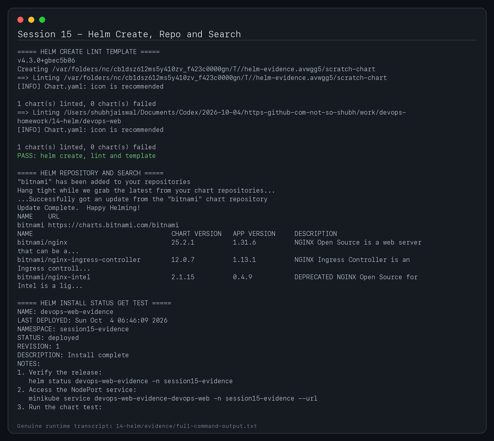
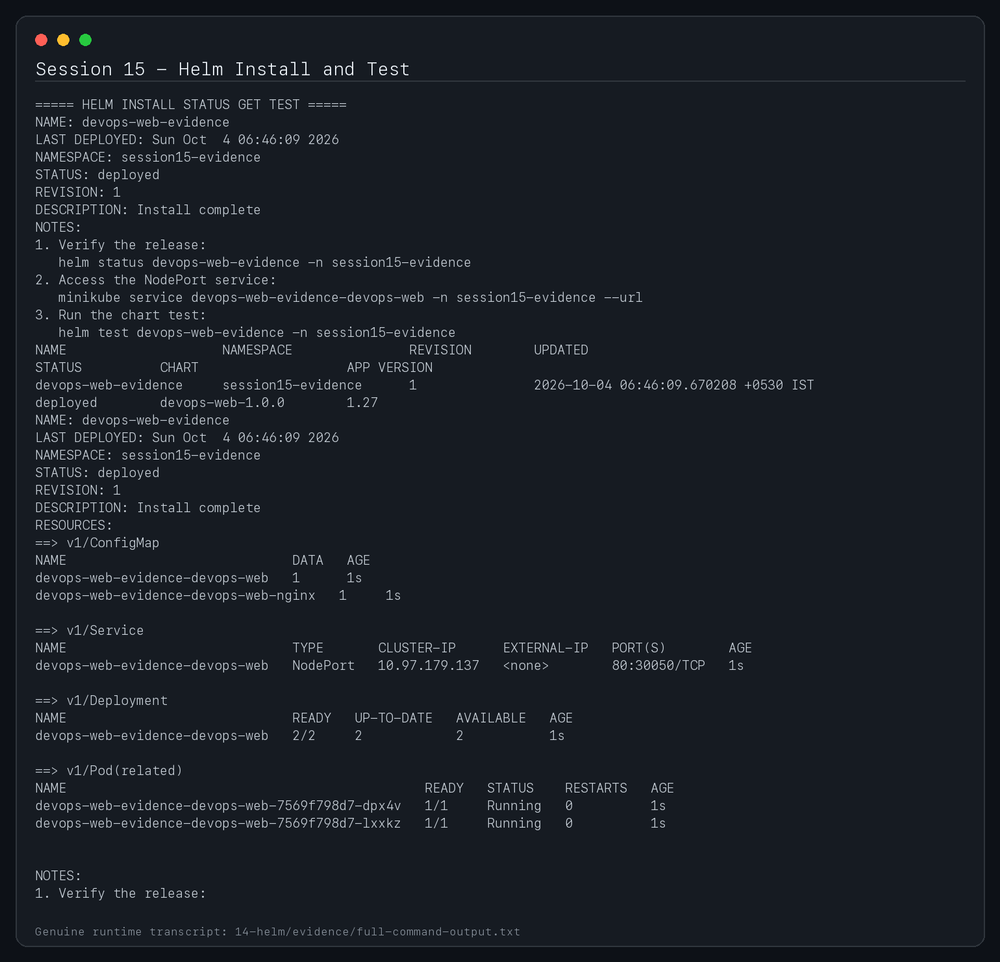
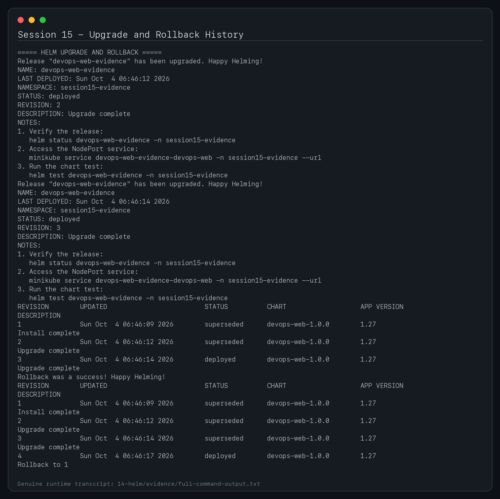
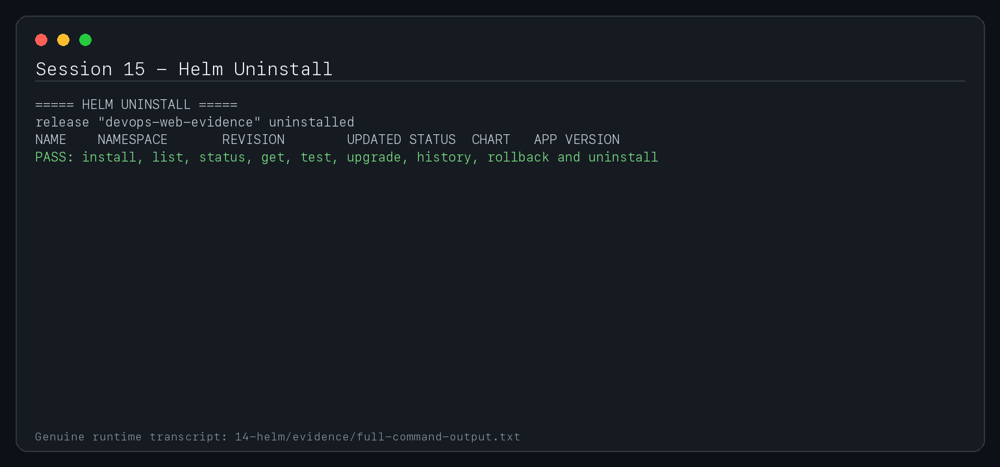

# Session 15 - Helm

**Student:** Shubh Jaiswal
**Enrollment:** 24BCS10601

The `devops-web` chart is the session mini-project. It deploys a configurable, probed, resource-limited Nginx application with Service, optional Ingress, HPA, ConfigMap and Helm test.

## Command practice

```bash
helm create scratch-chart
helm lint ./devops-web
helm template devops-web ./devops-web --namespace session15
helm install devops-web ./devops-web --namespace session15 --create-namespace --wait
helm list -n session15
helm status devops-web -n session15
helm get all devops-web -n session15
helm get values devops-web -n session15
helm history devops-web -n session15
helm test devops-web -n session15
helm search repo nginx
helm repo list
```

`helm template` performs local rendering. `install` creates a release; `list` inventories releases; `status` summarizes one release; `get` retrieves its rendered data; `upgrade` changes release state; `history` lists revisions; `rollback` restores a prior revision; `uninstall` deletes release resources; and `repo`/`search` manage and query chart repositories.

## Complete upgrade and rollback workflow

```bash
# Revision 1
helm install devops-web ./devops-web -n session15 --create-namespace --wait
kubectl get all -n session15
curl "$(minikube service devops-web -n session15 --url)"

# Revision 2
helm upgrade devops-web ./devops-web -n session15 \
  --set replicaCount=3 --set page.message='Revision 2' --wait
helm status devops-web -n session15
helm history devops-web -n session15

# Revision 3
helm upgrade devops-web ./devops-web -n session15 \
  --set replicaCount=2 --set page.message='Revision 3' --wait
helm get values devops-web -n session15

# Return to revision 1 and verify
helm rollback devops-web 1 -n session15 --wait
helm history devops-web -n session15
kubectl rollout status deployment/devops-web -n session15
helm test devops-web -n session15

# Cleanup
helm uninstall devops-web -n session15
kubectl delete namespace session15
```

## Validation

```bash
helm lint ./devops-web
helm template devops-web ./devops-web --namespace session15 | kubectl apply --dry-run=client -f -
```

Store genuine install/upgrade/rollback output under `evidence/`.

## Submission screenshots








