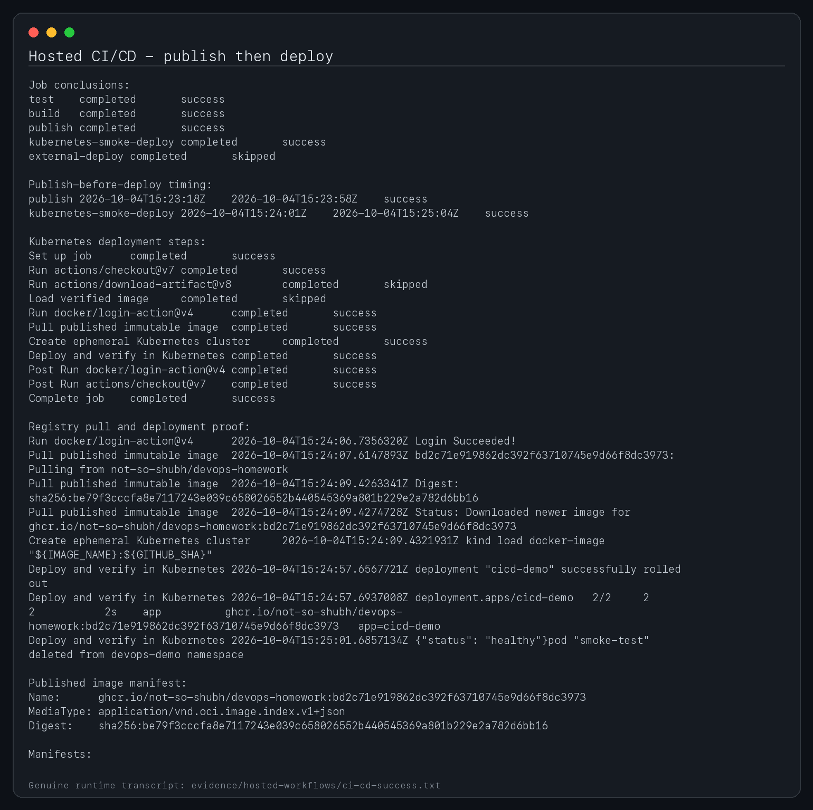

# Session 16 - CI/CD and GitHub Actions

**Student:** Shubh Jaiswal
**Enrollment:** 24BCS10601

This project provides a dependency-free Python web service, unit tests, a hardened Dockerfile, Kubernetes manifests and the repository workflow [`.github/workflows/ci-cd.yml`](../.github/workflows/ci-cd.yml).

## CI vs CD

- **Continuous Integration** validates every change by compiling, testing, linting and building it in a clean runner.
- **Continuous Delivery/Deployment** deploys the built image to an ephemeral Kind cluster on every run, verifies the health endpoint, and publishes a multi-architecture immutable image to GHCR on `main`. An additional external-cluster rollout is available only when the deployment secret is configured.

## Workflow model

A **workflow** is the YAML automation definition. A **job** is an isolated unit scheduled on a **runner**. Each job contains ordered **steps**. Jobs exchange files through **artifacts** and explicit outputs. Secrets are injected only into the step that needs them and are never printed.

```text
push / pull request
        |
        v
  test and package ----> uploaded test artifact
        |
        v
  Docker build and image artifact
        |
        v
  Kind Kubernetes smoke deployment + health check
        |
        +---- main branch ----> multi-architecture GHCR image
                                  |
                                  +---- KUBE_CONFIG configured ----> external Kubernetes rollout
```

## Local verification

```bash
python3 -m unittest discover -s application/tests -v
python3 -m py_compile application/app.py
docker build -t devops-homework-cicd:local .
docker run --rm -d --name devops-cicd -p 8086:8080 devops-homework-cicd:local
curl -fsS http://127.0.0.1:8086/health
curl -fsS http://127.0.0.1:8086/
docker rm -f devops-cicd
kubectl apply --dry-run=client -f kubernetes/
```

## GitHub configuration

The workflow uses the built-in `GITHUB_TOKEN` with `packages: write` to publish `ghcr.io/<owner>/devops-homework`. The ephemeral Kubernetes deployment requires no repository secret. External CD requires one optional secret:

- `KUBE_CONFIG`: a base64-encoded, least-privilege kubeconfig for the target namespace.

Environment protection rules should require approval before production deployment. Pipeline logs and the `test-results` artifact provide execution evidence.

The hosted pipeline publishes the immutable SHA-tagged image first, then pulls that registry artifact into an ephemeral Kind cluster for deployment verification. This demonstrates the assignment's required build/test/push/deploy sequence without requiring a permanent external cluster. The optional production job remains protected by `ENABLE_KUBERNETES_DEPLOY` and `KUBE_CONFIG`.

## Successful pipeline screenshot


