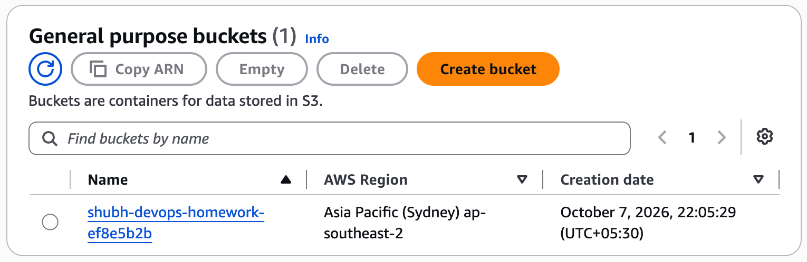
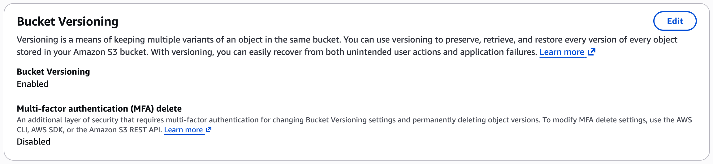
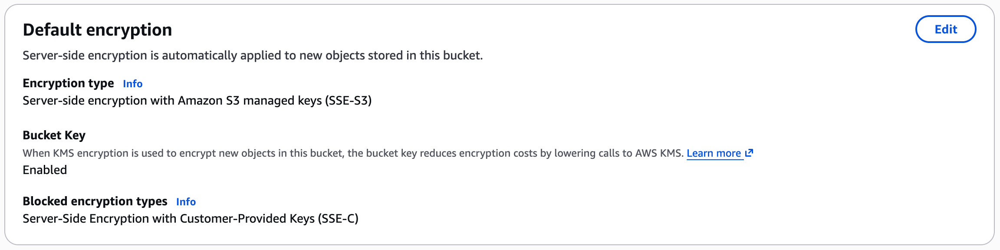
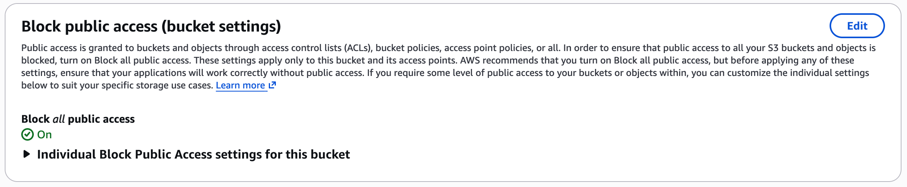

# Terraform S3 Demo

The configuration creates a globally unique private S3 bucket with versioning, SSE-S3 encryption, ownership enforcement, complete public-access blocking, lifecycle cleanup for non-current versions and consistent tags.

## Workflow

```bash
terraform init
terraform fmt -check
terraform validate
terraform plan -out=tfplan
terraform apply tfplan
terraform show
terraform output
aws s3api get-public-access-block --bucket "$(terraform output -raw bucket_name)"
terraform plan -destroy -out=destroy.tfplan
terraform apply destroy.tfplan
```

`init` installs providers; `fmt` normalizes style; `validate` checks internal correctness; `plan` previews changes; `apply` reconciles real infrastructure; `show` inspects state; `output` exposes declared results; and the final destroy plan/application removes lab resources.

## Security and state

- Use an AWS profile or short-lived identity; never store access keys in `.tf`, `.tfvars` or GitHub.
- Treat `terraform.tfstate` as sensitive because it records resource attributes. It is ignored locally; teams should use an encrypted S3 backend with locking.
- The bucket is private by construction. Public ACLs and public policies are blocked.
- `force_destroy=false` protects objects from accidental deletion. Empty the lab bucket before destroying, or deliberately override only after review.

Capture successful command output and the AWS console bucket properties after running with an authorized lab account.

## Live AWS evidence

The configuration was applied in `ap-southeast-2` on 7 October 2026. Terraform created all seven planned objects, the AWS Console confirmed the security controls below, and Terraform then destroyed all seven objects successfully. The sanitized [plan, apply, state, output and destroy transcript](../../evidence/command-outputs/aws-session18-live.txt) records the complete lifecycle.

### Bucket inventory and region



### Versioning



### Default encryption



### Public-access protection


