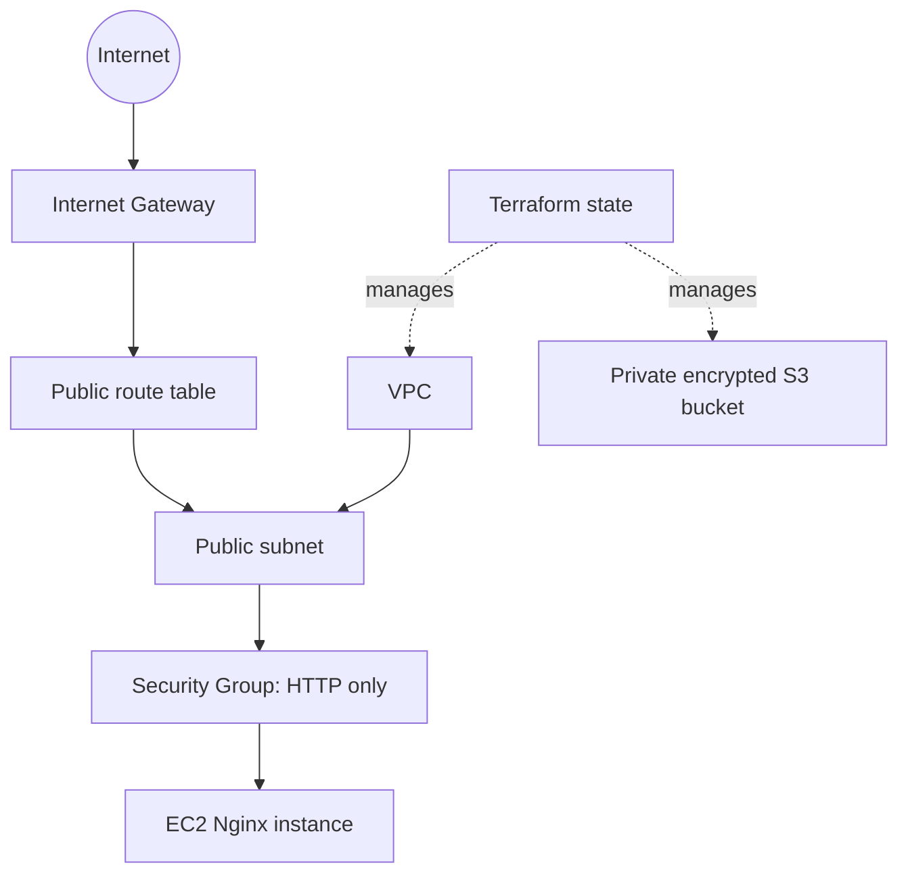

# Session 19 - Cloud and Terraform in Action

**Student:** Shubh Jaiswal
**Enrollment:** 24BCS10601

This project provisions a VPC, public subnet, route table, Internet Gateway, Security Group, EC2 web server and private S3 bucket. It demonstrates providers, variables, resources, outputs, explicit and implicit dependencies, Terraform state and the full plan/apply/destroy lifecycle.

## Architecture



The subnet depends on the VPC through `vpc_id`; the route depends on the Internet Gateway; the instance depends on the subnet and Security Group; and the route-table association connects public routing to the subnet. Terraform derives these edges from references and evaluates independent resources in parallel.

## Workflow

```bash
terraform init
terraform fmt -check
terraform validate
terraform plan -out=tfplan
terraform apply tfplan
terraform show
terraform output
curl "$(terraform output -raw application_url)"
terraform plan -destroy -out=destroy.tfplan
terraform apply destroy.tfplan
```

## State and safety

Terraform state maps configuration addresses to real AWS object IDs. Never edit it by hand or commit it. A team should migrate it to encrypted remote storage with locking and narrowly scoped IAM. The lab opens only TCP/80; it does not expose SSH. EC2 and public IPv4 can incur charges, so inspect the plan and destroy the lab when finished.

Use short-lived AWS credentials or an SSO profile. Capture the plan summary, applied resource inventory, browser/curl response, AWS console resources and successful destroy output.
