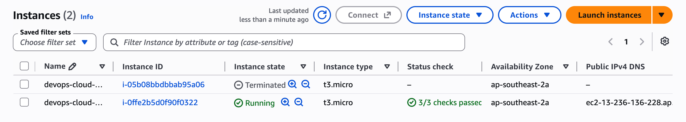
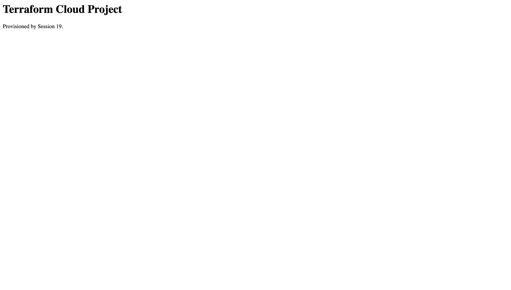
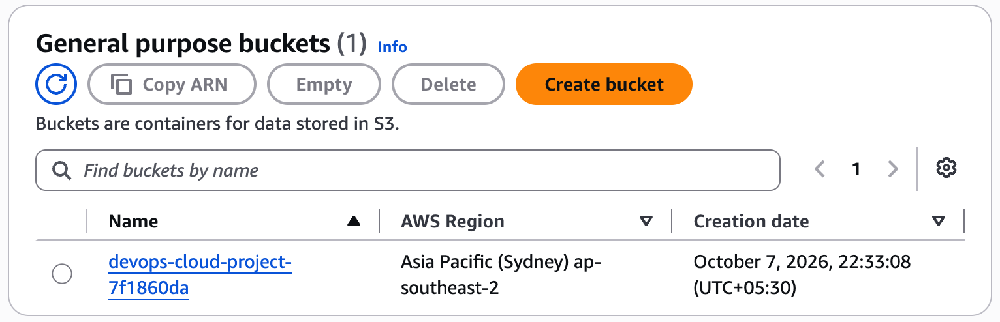
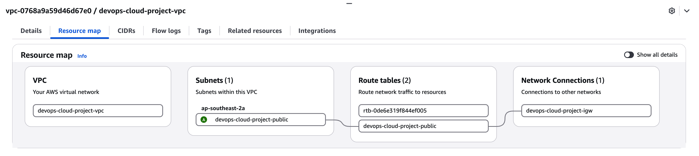
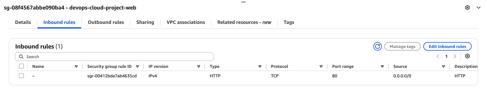

# Session 19 Evidence

This evidence was captured from an authorized live AWS deployment in `ap-southeast-2` on 7 October 2026. Terraform applied all 11 planned resources, the Nginx endpoint returned the expected Session 19 page, and Terraform destroyed all 11 resources after capture. The sanitized [complete Terraform transcript](aws-session19-live.txt) contains `init`, validation, saved plan, apply, state, outputs, HTTP verification, destroy plan and successful cleanup.

## EC2 instance

The live `t3.micro` instance passed all three EC2 status checks. The terminated row is the automatically cleaned first readiness attempt and incurred no further compute time.

## Live application

## Artifact bucket

## VPC architecture

The live resource map proves the public subnet, route table and Internet Gateway connection in the custom VPC.

## Network security

The security group exposes only the assignment-required HTTP port; SSH is not opened.

