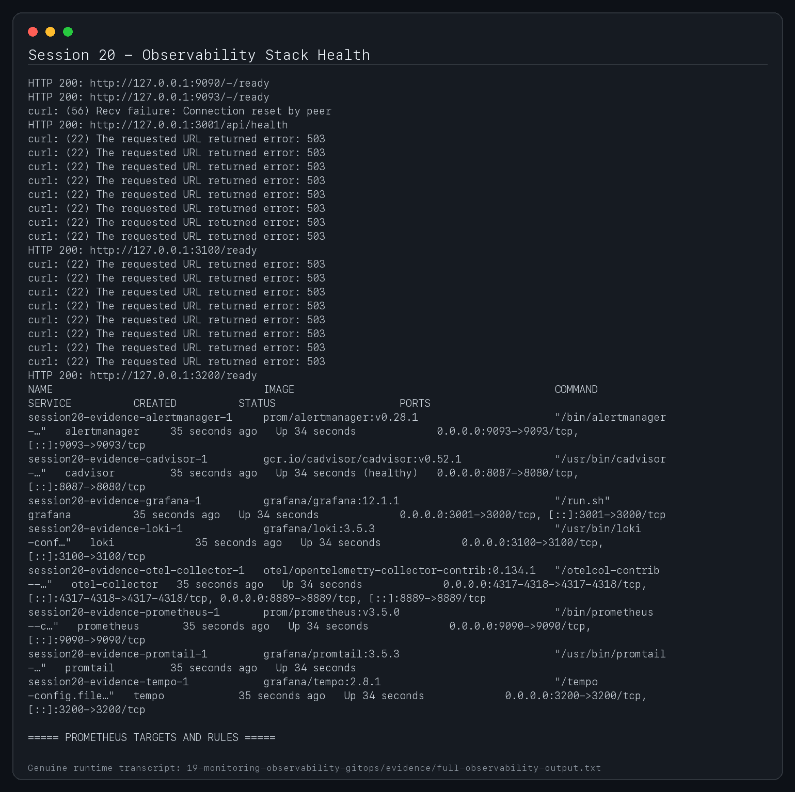
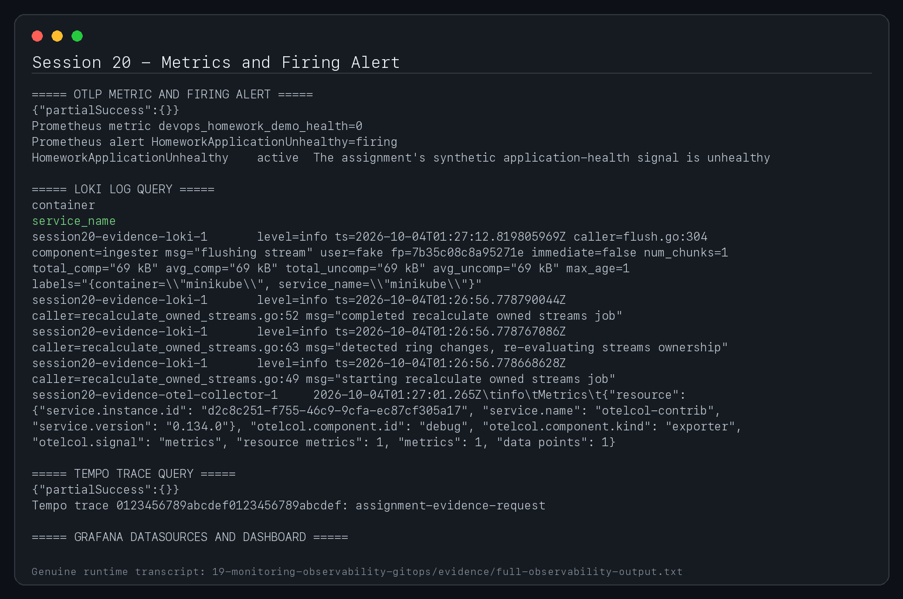
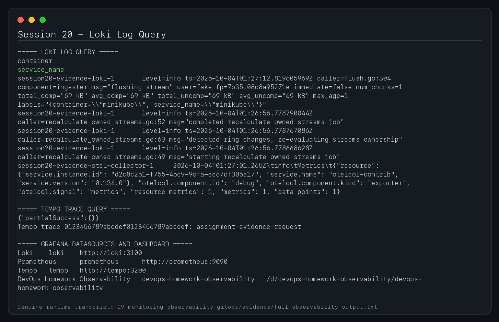
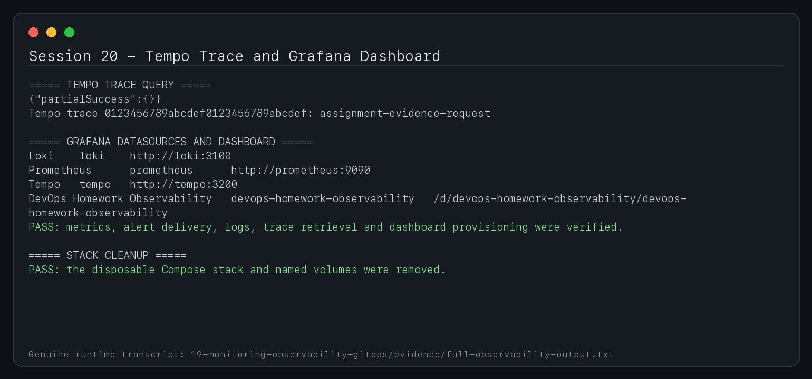
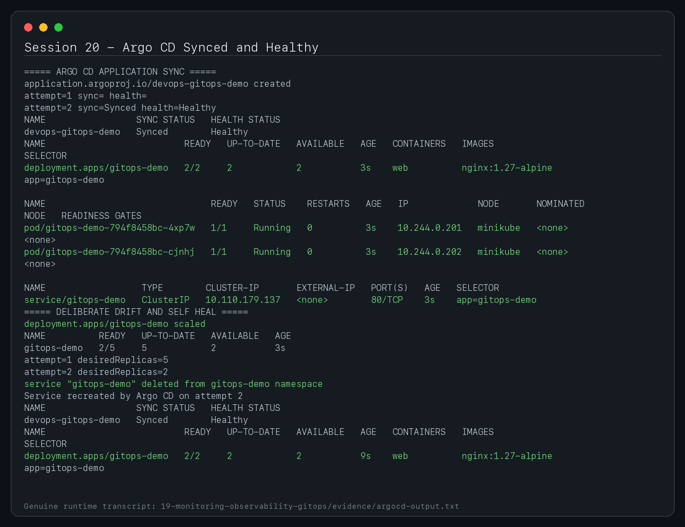
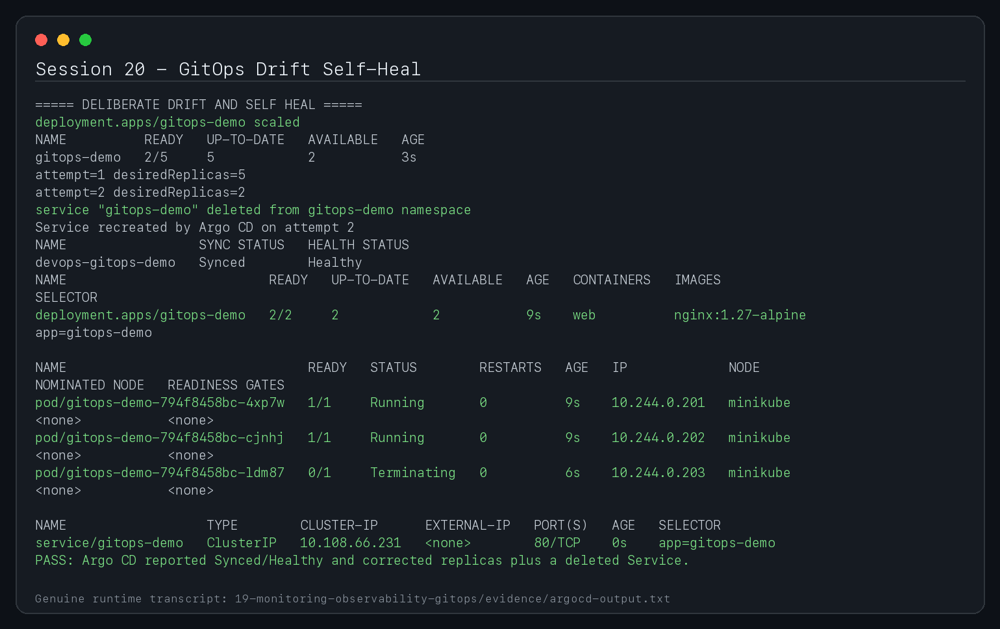

# Session 20 - Monitoring, Observability and GitOps

**Student:** Shubh Jaiswal
**Enrollment:** 24BCS10601

This lab supplies a local observability stack and a GitOps reconciliation example.

## Monitoring demo

```bash
docker compose up -d
docker compose ps
curl -fsS http://localhost:9090/-/ready       # Prometheus
curl -fsS http://localhost:9093/-/ready       # Alertmanager
curl -fsS http://localhost:3001/api/health    # Grafana
curl -fsS http://localhost:3100/ready         # Loki
```

Open Grafana at `http://localhost:3001` with the lab-only local credentials `admin` / `devops-lab-change-me`. The provisioned datasources expose:

- Prometheus metrics and alert state
- Loki logs collected from Docker containers
- Tempo traces received through the OpenTelemetry Collector

Prometheus scrapes itself, Alertmanager, cAdvisor and the OpenTelemetry Collector. `prometheus/rules.yml` alerts on missing targets, high container CPU, high memory and unhealthy applications. Alertmanager groups repeated alerts; the lab receiver intentionally does not send external notifications.

Stop and remove only this stack:

```bash
docker compose down -v
```

## Observability pillars

| Pillar | Meaning | Diagnostic question | Common tools |
|---|---|---|---|
| Metrics | Numeric time series sampled over time | Is the service becoming slow or saturated? | Prometheus, CloudWatch, Grafana |
| Logs | Timestamped discrete records describing events | What happened for this request/process? | Loki, Elasticsearch, CloudWatch Logs |
| Traces | A request's spans and causal path across services | Where was end-to-end latency introduced? | OpenTelemetry, Tempo, Jaeger |

Monitoring watches known signals and conditions. Observability is the broader ability to explain internal behavior from emitted telemetry, including failures that were not predicted in advance. Correlation IDs connect logs to trace IDs; exemplars connect latency metrics to representative traces.

For Kubernetes, collect control-plane/workload metrics, kube-state-metrics, node/container metrics, structured application logs and distributed traces. Alert on user-impacting symptoms and SLO burn rate, not merely every low-level fluctuation. Resource requests/limits, HPA state, restart counts and probe failures are essential context.

## GitOps

GitOps keeps declarative desired state in Git. A controller continuously compares that desired state with the cluster and reconciles drift. Changes are proposed through commits and reviews, creating an auditable rollback path.

```text
developer -> pull request -> reviewed Git desired state
                                  |
                                  v
                         Argo CD reconciliation loop
                                  |
                                  v
                         Kubernetes actual state
```

Install Argo CD, then apply the supplied `Application`:

```bash
kubectl create namespace argocd
kubectl apply -n argocd -f https://raw.githubusercontent.com/argoproj/argo-cd/stable/manifests/install.yaml
kubectl wait --for=condition=Available deployment/argocd-server -n argocd --timeout=300s
kubectl apply -f gitops/application.yaml
kubectl get applications -n argocd
kubectl get all -n gitops-demo
```

Automated sync, pruning and self-healing make Git the source of truth. Production repositories should require reviews, signed changes, policy checks and environment promotion rather than allowing direct image-tag edits.

## Submission evidence gallery












