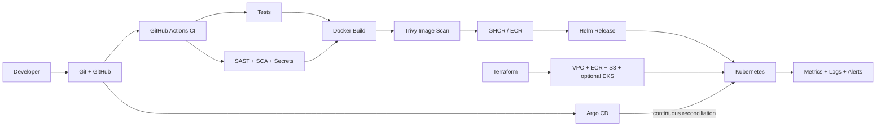

# Final End-to-End DevOps Project

**Student:** Shubh Jaiswal
**Enrollment:** 24BCS10601

## Project overview

This project takes a tested Python service from source control through security gates, container publishing, Kubernetes deployment, Helm lifecycle management, cloud provisioning, monitoring and GitOps reconciliation. Every deployable artifact is declarative and reviewable.

## Architecture



## Technologies

Python, unittest, Git/GitHub, GitHub Actions, Docker, GHCR/ECR, Kubernetes, Helm, Terraform, AWS, Bandit, pip-audit, Gitleaks, Trivy, Prometheus, Grafana/Loki/Tempo concepts and Argo CD.

## Application setup

```bash
python3 -m unittest discover -s application/tests -v
PORT=8080 python3 application/app.py
curl http://127.0.0.1:8080/
curl http://127.0.0.1:8080/health
curl http://127.0.0.1:8080/metrics
```

The service exposes health, readiness and Prometheus endpoints and writes structured JSON access logs.

## Docker setup

From this directory:

```bash
docker build -f docker/Dockerfile -t final-devops-project:local .
docker run --rm -d --name final-app -p 8088:8080 final-devops-project:local
curl -fsS http://127.0.0.1:8088/health
docker inspect --format '{{json .State.Health}}' final-app
docker rm -f final-app
```

The image uses a pinned minimal Alpine base, installs only the Python runtime, runs with a non-root UID, defines an explicit healthcheck and embeds no credentials.

## Kubernetes deployment

```bash
minikube addons enable ingress
minikube addons enable metrics-server
kubectl apply -k kubernetes/
kubectl wait --for=condition=available deployment/final-app -n final-devops --timeout=180s
kubectl get all,configmap,secret,pvc,ingress,hpa,pdb,networkpolicy -n final-devops
kubectl port-forward -n final-devops service/final-app 8088:80
curl http://127.0.0.1:8088/health
```

The deployment includes ConfigMap, lab-only Secret placeholder, Service, TLS-capable Ingress, HPA, startup/readiness/liveness probes, PVC, PodDisruptionBudget, resource controls and default-deny NetworkPolicy. Create the TLS Secret from a locally generated certificate before testing HTTPS; never commit a private key.

## Helm deployment

```bash
helm lint helm/final-app
helm upgrade --install final-app helm/final-app -n final-devops --create-namespace --wait
helm test final-app -n final-devops
helm upgrade final-app helm/final-app -n final-devops --set config.message='Release 2' --wait
helm history final-app -n final-devops
helm rollback final-app 1 -n final-devops --wait
```

## Terraform infrastructure

The `terraform/` project provisions a VPC, two subnets, routing, ECR and a private versioned S3 bucket. EKS and its node group are present but protected by `enable_eks=false` because they incur charges. Follow [`terraform/README.md`](terraform/README.md), review the saved plan and destroy the cloud lab when evidence is captured.

## CI/CD and DevSecOps

The executable workflow is [`.github/workflows/final-project.yml`](../../.github/workflows/final-project.yml). It runs tests, Bandit SAST, pip-audit SCA, Gitleaks, Kubernetes/Helm/Terraform validation, a Docker build and Trivy image gate. The gated revision is deployed with Helm to an ephemeral Kind cluster and must pass the chart test before the workflow publishes multi-architecture immutable SHA and `latest` tags. External production deployment is protected by `ENABLE_FINAL_DEPLOY=true`, a least-privilege `KUBE_CONFIG` secret and GitHub environment approval.

## Monitoring

The application emits `/metrics` and structured logs. [`monitoring/`](monitoring/) provides Prometheus discovery, alerts and a ServiceMonitor. Important signals include availability, request/error/latency rates, CPU, memory, restarts, probe failures, saturation and HPA state. Logs and traces should carry request/trace IDs so Grafana, Loki and Tempo views correlate.

## GitOps

[`gitops/application.yaml`](gitops/application.yaml) defines an Argo CD application that renders the Helm chart from Git, automatically prunes obsolete resources and self-heals drift. Production promotion should update immutable image tags through reviewed pull requests.

## Troubleshooting

[`troubleshooting/`](troubleshooting/) contains an intentional multi-fault challenge and the documented identify-investigate-root-cause-fix-verify workflow. It covers image pull failure, missing configuration and Service selector mismatch without inventing output.

## Lessons learned

- A file passing syntax checks is not proof that the workload ran; runtime evidence and observable behavior matter.
- Immutable artifacts plus declarative configuration make rollback and audit straightforward.
- Security must gate delivery before publication, and runtime least privilege is distinct from build-time scanning.
- Requests, probes, telemetry and runbooks are part of application correctness, not optional production polish.
- GitOps reduces configuration drift, but protected review and safe secret delivery remain necessary.
- Cloud resources require cost awareness, remote state protection and deliberate teardown.

## Evidence

Follow [`evidence/README.md`](evidence/README.md). Never fabricate a successful cloud apply, pipeline run or screenshot; every submitted output must originate from the student's account and environment.
