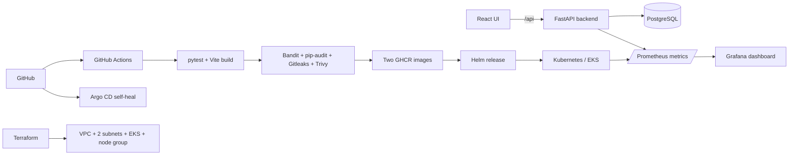
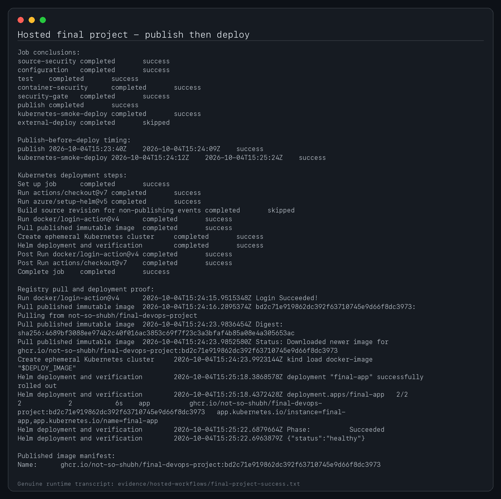
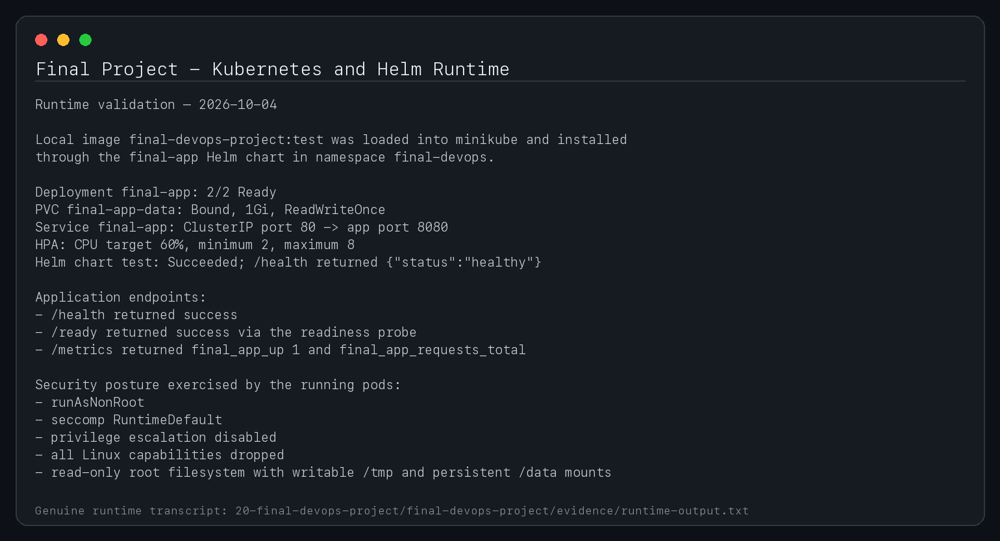
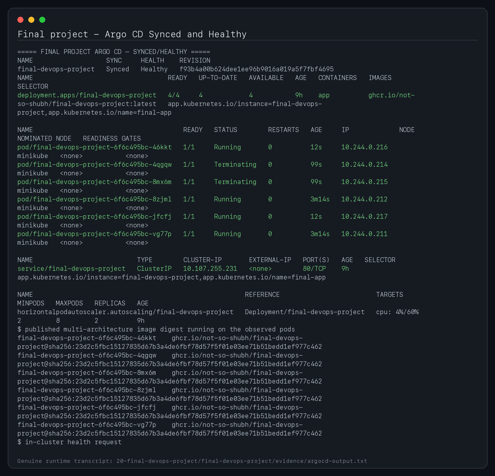

# Release Tracker — Final End-to-End DevOps Project

**Student:** Shubh Jaiswal

**Enrollment:** 24BCS10601

Release Tracker is an original full-stack application for recording software releases across development, staging and production. It combines a responsive React interface, a FastAPI REST API and PostgreSQL with a complete secure-delivery platform: automated testing, two-image security gates, GHCR publishing, Kubernetes, Helm, Terraform/AWS, Prometheus/Grafana and Argo CD.

## Architecture



## Application features

- Create, list, inspect, update and delete release records.
- Validate environment and status values with Pydantic.
- Store data in PostgreSQL using SQLAlchemy and an Alembic migration.
- Report health at `/health`, database readiness at `/ready`, OpenAPI at `/docs` and Prometheus telemetry at `/metrics`.
- Filter release cards and view live healthy/deploying/failed totals in a responsive React interface.

### REST API

| Method | Route | Purpose |
|---|---|---|
| `GET` | `/api/releases` | List releases |
| `GET` | `/api/releases/{id}` | Get one release |
| `POST` | `/api/releases` | Create a release |
| `PUT` | `/api/releases/{id}` | Replace a release |
| `DELETE` | `/api/releases/{id}` | Delete a release |
| `GET` | `/api/releases/stats` | Aggregate delivery state |

## Run locally with Docker Compose

```bash
cp .env.example .env
# Set a local-only PostgreSQL password in .env.
docker compose up --build -d
docker compose ps
open http://localhost:8088
curl -fsS http://localhost:8088/health
curl -fsS http://localhost:8088/api/releases
docker compose down -v
```

Compose starts all three required services: frontend, backend and PostgreSQL. The backend executes `alembic upgrade head` before serving traffic. Both application images use non-root users; the frontend uses a Node build stage and an unprivileged Nginx runtime.

## Test and build without Compose

```bash
python3 -m venv backend/.venv
backend/.venv/bin/pip install -r backend/requirements-dev.txt
(cd backend && .venv/bin/pytest -v)

(cd frontend && npm ci && npm run build && npm audit --audit-level=high)
```

The test suite has eight test cases across health, readiness, metrics and every CRUD behavior. Tests override the application dependency with an isolated in-memory SQLite database; they never use production data.

## CI/CD and DevSecOps

The root [final-project workflow](../../.github/workflows/final-project.yml) runs on every relevant pull request and `main` push:

1. Run eight pytest tests and a clean Vite production build.
2. Run Bandit SAST, pip-audit SCA and Gitleaks history scanning.
3. Validate Kustomize, Helm and Terraform configurations.
4. Build backend and frontend images independently.
5. Fail each image job on any `HIGH` or `CRITICAL` Trivy finding and upload both SARIF reports.
6. After every gate passes, publish both images to GHCR using immutable commit-SHA and `latest` tags.
7. Pull those exact SHA images into a disposable Kind cluster, deploy the three-tier chart and run Helm connectivity tests.

The optional permanent deployment runs only when the repository variable `ENABLE_FINAL_DEPLOY=true` and a protected environment provides `KUBE_CONFIG`.

## Kubernetes and Helm

Raw manifests in `kubernetes/` and the production-style chart in `helm/final-app/` both provide:

- dedicated `final-devops` namespace;
- two backend and two frontend replicas;
- internal ClusterIP services named `backend`, `frontend` and `database`;
- PostgreSQL persistence and a lab-only placeholder Secret;
- startup/readiness/liveness probes, resource requests/limits and restricted security contexts;
- HPA for the backend, disruption budgets and ingress routing `/api` to the API and `/` to the UI.

```bash
helm lint helm/final-app
helm upgrade --install final-app helm/final-app \
  --namespace final-devops --create-namespace --wait
kubectl get deployment,pods,service,ingress,hpa -n final-devops
helm test final-app -n final-devops --logs
```

Do not use the committed lab password in a real environment. Supply `postgres.password` through a secret manager or encrypted values file.

## Terraform and AWS

`terraform/` defines valid HCL for a VPC, Internet Gateway, two public subnets in separate availability zones, routes, a private versioned S3 artifact bucket, immutable ECR repository, EKS cluster and managed node group. Copy `terraform.tfvars.example` to the ignored `terraform.tfvars` and review costs before enabling EKS.

```bash
cd terraform
cp terraform.tfvars.example terraform.tfvars
terraform init
terraform fmt -check
terraform validate
terraform plan -out=tfplan
terraform apply tfplan
terraform output
terraform destroy
```

The default variable keeps billable EKS resources disabled; the example enables them for the supervised grading run. Genuine apply/destroy evidence must come from an authorized AWS account.

## Observability

The backend exposes request totals and duration histograms at `/metrics`. The `monitoring/` directory includes a ServiceMonitor, Prometheus discovery, alerts, kube-prometheus-stack values and a provisioned Grafana dashboard with request-rate, p95-latency and status-code panels.

The required hosted `observability-smoke` job also starts the application and monitoring Compose files together, generates requests, asserts that Prometheus is scraping non-zero application samples, verifies Grafana loaded the dashboard and uploads genuine UI/dashboard screenshots.

```bash
docker compose -f docker-compose.yml -f monitoring/docker-compose.yml up --build -d --wait
open http://localhost:3001/d/release-tracker/release-tracker
```

```bash
helm repo add prometheus-community https://prometheus-community.github.io/helm-charts
helm upgrade --install monitoring prometheus-community/kube-prometheus-stack \
  -n monitoring --create-namespace -f monitoring/kube-prometheus-stack-values.yaml
kubectl apply -f monitoring/dashboard.yaml
kubectl apply -f monitoring/servicemonitor.yaml
```

## GitOps and troubleshooting

`gitops/application.yaml` makes Argo CD render this chart from `main`, prune removed objects and self-heal drift. `troubleshooting/` retains the deliberate multi-fault exercise and its evidence-backed diagnosis/fix workflow.

## Project map

```text
backend/       FastAPI, SQLAlchemy, Alembic, pytest, backend Dockerfile
frontend/      React/Vite UI, Nginx config, multi-stage frontend Dockerfile
docker-compose.yml
kubernetes/    Raw three-tier manifests
helm/          Three-tier Helm chart and test hook
terraform/     VPC, two subnets, EKS and managed node group
monitoring/    Prometheus rules, ServiceMonitor and Grafana dashboard
gitops/        Argo CD Application
security/      Security policy and Gitleaks config
evidence/      Genuine runtime/pipeline screenshots and transcripts
```

See [RUBRIC-CROSSWALK.md](RUBRIC-CROSSWALK.md) for a criterion-by-criterion map and [evidence/README.md](evidence/README.md) for evidence provenance.

## Evidence gallery






