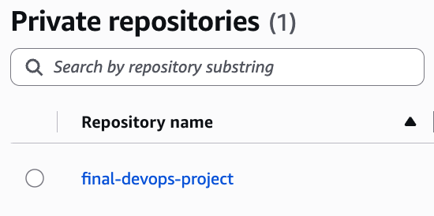
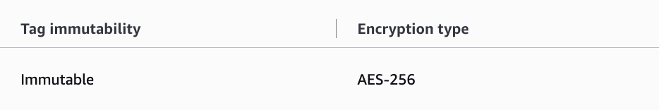
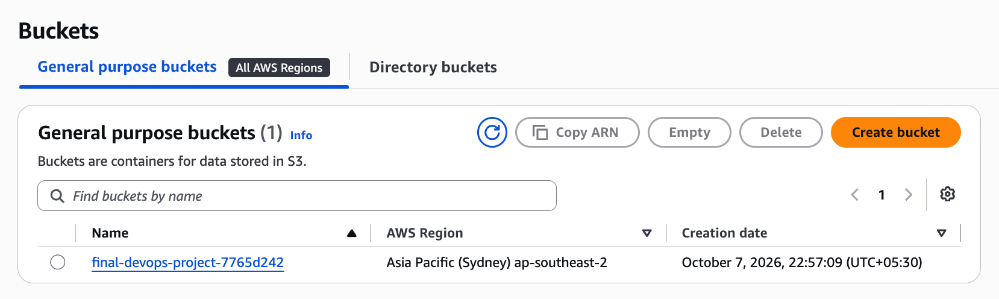
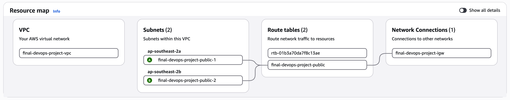

# Final Project Evidence

Capture: local tests; container health; SAST/SCA/secret/image scan reports; successful GitHub pipeline; registry image and immutable SHA; Terraform plan/apply/outputs/destroy; Kubernetes resources; ConfigMap/Secret injection; TLS Ingress; HPA/probes/storage; Helm install/upgrade/rollback/test; Prometheus metrics and alerts; logs/traces; Argo CD Synced/Healthy and self-healing; and the complete broken/fixed troubleshooting challenge.

Completed local evidence:

- Eight FastAPI pytest cases, a zero-vulnerability pip-audit, a zero-vulnerability npm audit and clean frontend build were rerun after the instructor-rubric upgrade.
- Helm rendered 13 resources, Kustomize rendered 14 resources and kubeconform accepted all 27 with zero invalid/skipped resources.
- The live API served 100/100 concurrent health requests and exposed the matching Prometheus counter.

- [Kubernetes and Helm lifecycle](01-kubernetes-helm.png)
- [Broken troubleshooting state](02-troubleshooting-broken.png)
- [Fixed troubleshooting state and HTTP 200](03-troubleshooting-fixed.png)
- [Full troubleshooting transcript](troubleshooting-output.txt)
- [Argo CD Synced/Healthy proof](04-argocd-sync.png)
- [Argo CD configuration and deleted-Service self-healing](05-argocd-self-heal.png)
- [Full Argo CD transcript](argocd-output.txt)
- [Successful hosted final-project pipeline, two multi-architecture images and Kind deployment](../../../evidence/hosted-workflows/final-project-success.txt)
- [Hosted Release Tracker UI](../../../evidence/hosted-workflows/release-tracker-observability/release-tracker-ui.png)
- [Hosted populated Grafana dashboard](../../../evidence/hosted-workflows/release-tracker-observability/release-tracker-grafana.png)

GitHub Actions run [37647537916](https://github.com/not-so-shubh/devops-homework/actions/runs/37647537916) created the two checked-in observability screenshots from the running Compose stack. The same run published both immutable images, deployed the three-tier Helm release into Kind, rolled out all five application/database pods and passed the Helm connectivity test.

## Live AWS infrastructure

An authorized cost-controlled AWS run was completed in `ap-southeast-2` on 7 October 2026. Terraform applied all 12 planned ECR, S3 and networking resources, the AWS Console confirmed the resources below, and Terraform then destroyed all 12 resources. EKS remained deliberately disabled because the assignment infrastructure can be evidenced without incurring its separate control-plane and node charges.

The sanitized [complete Terraform transcript](aws-final-infrastructure-live.txt) records initialization, validation, saved plan, apply, state, outputs, destroy plan and successful cleanup.

### ECR repository

### S3 artifact bucket

### Multi-AZ VPC

