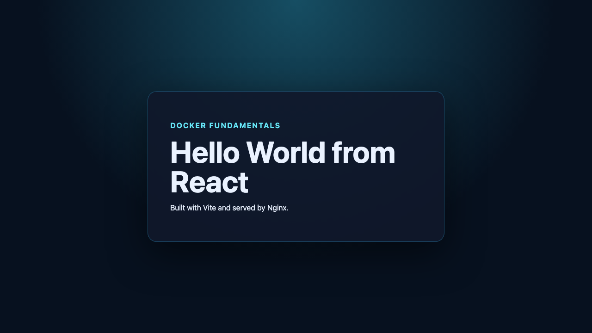

# Docker Fundamentals

Six independent applications demonstrate common Dockerfile patterns while serving distinct, exact Hello World text.

| Service | Implementation | Container port | Default host port | Expected text |
|---|---|---:|---:|---|
| `nodejs` | Express on Node.js | 3000 | 3000 | `Hello World from Node.js` |
| `python` | Flask via Gunicorn | 5000 | 5000 | `Hello World from Python` |
| `java` | JDK standard-library HTTP server | 8080 | 8081 | `Hello World from Java` |
| `apache` | Static page on official `httpd` | 80 | 8082 | `Hello World from Apache` |
| `react` | Vite build served by Nginx | 80 | 8083 | `Hello World from React` |
| `nginx` | Static page on official Nginx | 80 | 8084 | `Hello World from Nginx` |

## Build and run everything

```bash
docker compose up --build -d
docker compose ps

curl -fsS http://localhost:3000/
curl -fsS http://localhost:5000/
curl -fsS http://localhost:8081/
curl -fsS http://localhost:8082/
curl -fsS http://localhost:8083/
curl -fsS http://localhost:8084/

docker compose down
```

If a default port is busy, override only that mapping:

```bash
NODE_HOST_PORT=13000 PYTHON_HOST_PORT=15000 docker compose up --build -d
```

Available variables are `NODE_HOST_PORT`, `PYTHON_HOST_PORT`, `JAVA_HOST_PORT`, `APACHE_HOST_PORT`, `REACT_HOST_PORT`, and `NGINX_HOST_PORT`. Each mapping binds to `127.0.0.1` by default so the homework service is not exposed to the LAN. Set `HOST_BIND_ADDRESS=0.0.0.0` only when LAN access is intentional and host firewall policy has been reviewed.

Every child folder has its own source, Dockerfile, `.dockerignore`, and concise build/run notes. `scripts/verify-all.sh` chooses available high ports, asserts every expected string with `curl`, captures real evidence, and cleans up containers afterward.

## Objective and assignment requirements

Build and run separate Hello World web applications for Node.js, Python, Java, Apache, React, and Nginx. Every app has actual source/content, an official or maintained base image, a Dockerfile, a container port, and a distinct exact response phrase. The Compose file builds all six in one reproducible command.

## Implementation map

| App | Key files | Container details |
|---|---|---|
| Node.js | [`nodejs-app/server.js`](nodejs-app/server.js), [`Dockerfile`](nodejs-app/Dockerfile), [`package-lock.json`](nodejs-app/package-lock.json) | Express, Node 22 Alpine, non-root `node`, port 3000 |
| Python | [`python-app/app.py`](python-app/app.py), [`Dockerfile`](python-app/Dockerfile), [`requirements.txt`](python-app/requirements.txt) | Flask behind Gunicorn, `0.0.0.0:5000`, non-root user |
| Java | [`java-app/HelloServer.java`](java-app/HelloServer.java), [`Dockerfile`](java-app/Dockerfile) | Java 21 standard library, compile/runtime stages, port 8080 |
| Apache | [`Apache-app/index.html`](Apache-app/index.html), [`Dockerfile`](Apache-app/Dockerfile) | Official `httpd:2.4-alpine`, document root `/usr/local/apache2/htdocs` |
| React | [`React-app/src/main.jsx`](React-app/src/main.jsx), [`Dockerfile`](React-app/Dockerfile), [`package-lock.json`](React-app/package-lock.json) | Vite build stage, Nginx runtime, port 80 |
| Nginx | [`nginx-app/index.html`](nginx-app/index.html), [`Dockerfile`](nginx-app/Dockerfile) | Official `nginx:1.27-alpine`, document root `/usr/share/nginx/html` |

## Reproduce and verify

```bash
docker compose up --build -d
docker compose ps
curl -fsS http://localhost:3000/
curl -fsS http://localhost:5000/
curl -fsS http://localhost:8081/
curl -fsS http://localhost:8082/
curl -fsS http://localhost:8083/
curl -fsS http://localhost:8084/
docker compose down
```

If a host port is occupied, override its `*_HOST_PORT` variable as described above. The real six-service curl transcript and `docker compose ps` output are in [docker-fundamentals-curl.txt](../evidence/command-outputs/docker-fundamentals-curl.txt), and the full build log is [docker-fundamentals-build.txt](../evidence/command-outputs/docker-fundamentals-build.txt).

## Genuine browser evidence





These PNGs were captured from the live localhost services. The remaining terminal-only screenshot checklist is explicit in [`evidence/screenshots/README.md`](../evidence/screenshots/README.md); no terminal image is represented as captured here.

## What was learned

The exercise shows the difference between an application runtime (Node/Python/Java) and a static web server (Apache/Nginx), why React production builds should not ship `node_modules`, how `EXPOSE` documents an internal port, and why host-port selection belongs to Compose/environment configuration.
