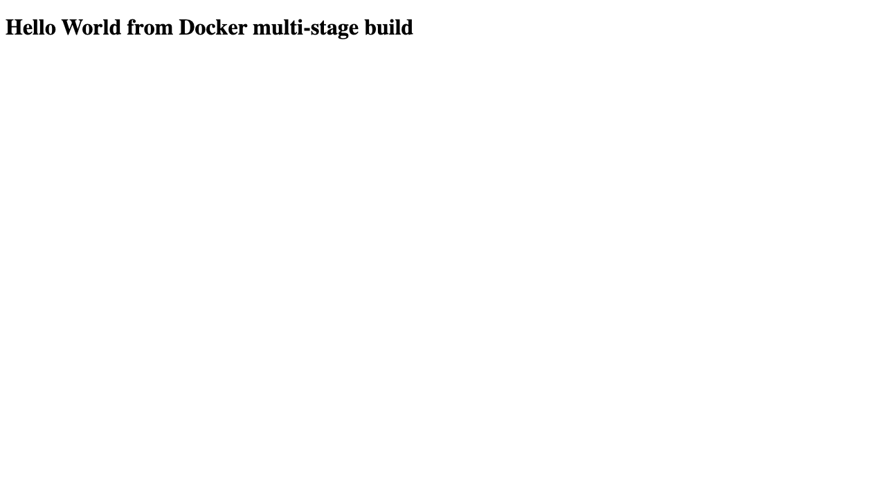

# Docker Multi-Stage Build

The original instructor repository URL was not present in the supplied project. This folder therefore contains a correct local equivalent instead of an invented clone source.

`multistage-app/Dockerfile` uses a Go compiler image only to build a static binary, then copies that binary into a small Alpine runtime with a non-root user. Compiler tools and source code are absent from the final image.

## Build, run, and verify

```bash
docker build -t devops-multistage-app ./multistage-app
docker run -d --name devops-multistage -p 8080:8080 devops-multistage-app
curl -fsS http://localhost:8080/
docker ps --filter name=devops-multistage
docker rm -f devops-multistage
```

The response clearly includes the exact required phrase:

```text
Hello World from Docker multi-stage build
```

## Three application types

The assignment's “at least three types” requirement is satisfied without redundant copies by the independently containerized applications under Docker Fundamentals:

- [Node.js / Express](../docker-fundamentals/nodejs-app/)
- [Python / Flask](../docker-fundamentals/python-app/)
- [Java 21](../docker-fundamentals/java-app/)

All three can run together using [the fundamentals Compose file](../docker-fundamentals/docker-compose.yml). See [submission.md](submission.md) for the student-facing evidence format.

## Objective and task requirements

Demonstrate a genuine multi-stage Dockerfile, expose the service on container port `8080`, serve the exact phrase `Hello World from Docker multi-stage build`, verify it with `curl` and `docker ps`, and document at least three application types. The local Go implementation is deliberately self-contained because no instructor multi-stage repository URL was supplied.

## Reproduce and verify

```bash
docker build -t devops-multistage-app ./multistage-app
docker run -d --name devops-multistage -p 8080:8080 devops-multistage-app
curl -fsS http://localhost:8080/
docker ps --filter name=devops-multistage
docker rm -f devops-multistage
```

The real build transcript is [docker-multistage-build.txt](../evidence/command-outputs/docker-multistage-build.txt), and the real curl/`docker ps` proof is [docker-multistage-output.txt](../evidence/command-outputs/docker-multistage-output.txt).



## Relevant files and learning summary

- [`multistage-app/Dockerfile`](multistage-app/Dockerfile) — Go compiler stage plus minimal Alpine runtime
- [`multistage-app/main.go`](multistage-app/main.go) — port-8080 HTTP server
- [`submission.md`](submission.md) — student-facing build/run/evidence instructions

The central lesson is that the compiler toolchain and source need not be present in the runtime image. The three required app types are reused from [Docker Fundamentals](../docker-fundamentals/README.md): Node.js/Express, Python/Flask, and Java 21.
