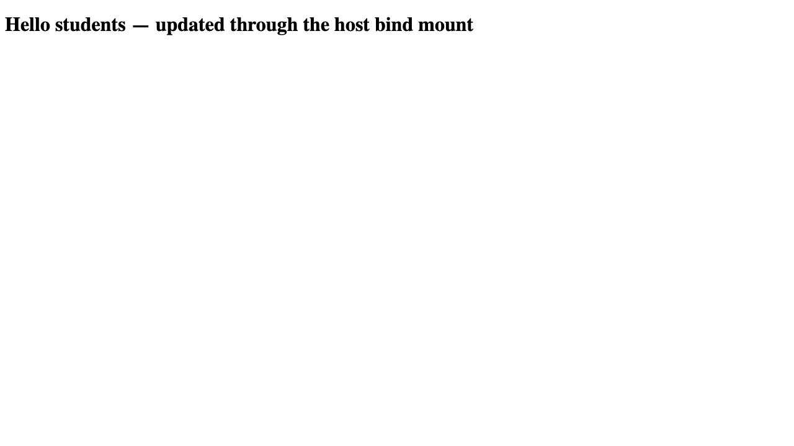

# Docker Networking and Volumes

This section contains four independent exercises:

1. [Three containers across three bridge networks](container-networking/)
2. [Apache using host networking](host-network/)
3. [Read-only Nginx bind mount with live host edits](bind-mount/)
4. [Multi-host overlay network concepts and Swarm commands](overlay-network.md)

The container-networking and bind-mount labs use distinctive project/container names and include scoped cleanup. The overlay lab is documentation-only because automatically changing a developer machine's Swarm state would be intrusive. Host mode is also manual because it may collide with an existing service on port 80.

## Objective and task requirements

This section covers the assignment's three-container/three-network topology, host networking, read-only bind mounts, and overlay-network theory. The topology keeps frontend, backend, and MySQL on named Docker networks; the bind-mount proof changes host content without restarting Nginx; and the overlay notes explain Swarm/multi-host behavior without changing Swarm state.

## Reproduce each lab

```bash
# Three networks and DNS-based connectivity/isolation
./container-networking/start.sh
./container-networking/verify.sh
./container-networking/stop.sh

# Read-only bind mount and live host edit
./bind-mount/run.sh
./bind-mount/verify.sh
docker rm -f devops-hw-bind-mount

# Guarded host-mode test (refuses a busy port 80)
./host-network/verify.sh
```

The real three-network transcript is [docker-network-output.txt](../evidence/command-outputs/docker-network-output.txt), and the real bind-mount transcript is [bind-mount-output.txt](../evidence/command-outputs/bind-mount-output.txt). The host-mode attempt is truthfully recorded in [host-network-output.txt](../evidence/command-outputs/host-network-output.txt): `--network host` was configured, but Docker Desktop did not expose port 80 on this Mac.

## Genuine bind-mount browser evidence




The after capture was taken against the same container ID with restart count zero. Native terminal-only network screenshots remain listed as manual in [`evidence/screenshots/README.md`](../evidence/screenshots/README.md).

## Relevant files and learning summary

- [`container-networking/docker-compose.yml`](container-networking/docker-compose.yml) — three named networks, MySQL healthcheck, demo-only credentials
- [`container-networking/verify.sh`](container-networking/verify.sh) — positive DNS paths and frontend/database isolation
- [`bind-mount/site/index.html`](bind-mount/site/index.html) — tracked source restored to `Hello students`
- [`host-network/README.md`](host-network/README.md) — Linux versus Docker Desktop behavior
- [`overlay-network.md`](overlay-network.md) — Swarm, VXLAN, ingress, encryption, and teardown

The main lesson is least-privilege network attachment: a service can resolve and reach only the peers on its shared networks. Host mode removes that isolation on native Linux, while an overlay extends service networking across Docker daemons.
